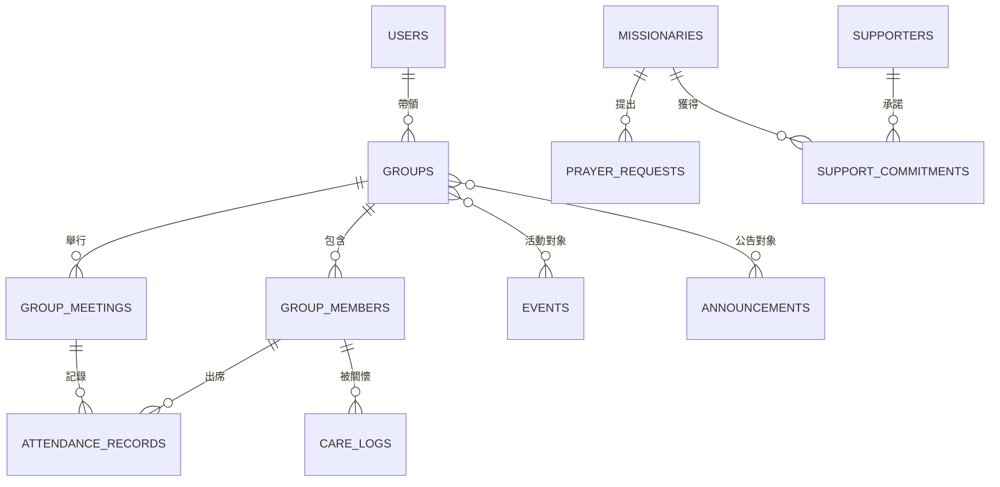

# Mission & Group Hub：研究依據與系統架構

**作者：Manus AI**  
**研究日期：2026-08-15（GMT+8）**

本系統採取「教會行政資料」與「牧養關係資料」並列的設計，而不把小組、宣教或關懷資訊混雜於單一名冊。這個邊界有助於以角色及所屬小組限制存取，並保留後續擴充分組保密、資料備份、資源分享與外部系統同步的空間。

| 研究發現 | 來源證據 | 本系統的設計回應 |
| --- | --- | --- |
| 小組帶領人應可管理出席、群組溝通與行事曆，並藉個別出席報表及早追蹤參與流失。 | Planning Center Groups 將出席、帶領人管理、群組活動與參與報表列為核心能力。[1] | 以小組、成員、聚會、出席與關懷日誌分表；Leader 僅可操作受指派的小組。 |
| 敏感群組成員資訊應有更細緻的存取控制。 | Planning Center 提供依群組範圍與成員身分的權限設定，並支援保密名冊。[1] | 後端將 Admin、Leader、Member 的權限檢查置於每個程序；後續可在 group 新增 confidentiality 欄位。 |
| 宣教支持者管理的重點不僅是捐款金額，亦包含承諾、頻率、關係跟進與異常模式辨識。 | MPDX 提供支持金額、承諾進度、捐款模式通知、聯絡人及任務追蹤。[2] | 將支持者主檔與支持承諾分離，並以頻率換算支持總覽；保留日後加入跟進任務及外部同步的位置。 |
| 自建系統的價值在於資料自主與可管理的核心模組，而非一次性堆疊所有功能。 | ChurchCRM 的官方文件將人員、群組、活動、出席、奉獻、使用者與權限、備份列為獨立管理面向，並強調資料自主。[3] | 本階段建立清晰的模組界線與關聯式資料表，避免將財務、代禱、關懷及公告寫入難以查詢的文字欄位。 |

## 角色與資料存取原則

| 角色 | 可檢視範圍 | 可異動範圍 |
| --- | --- | --- |
| Admin | 全部資料與全站統計 | 宣教士、支持者、代禱、小組、成員、活動、公告與角色設定。 |
| Leader | 指派小組、公開宣教與公開活動資訊 | 僅指派小組的成員、聚會、出席與關懷；可查看活動及公告。 |
| Member | 已啟用宣教士、未歸檔代禱、已發布活動與公告 | 不得存取支持金額、他人關懷紀錄或小組行政資料。 |

## 關聯式資料模型

系統以 `missionaries` 為宣教士主檔，並透過 `supportCommitments` 連結支持者，以支援一位支持者支持多位宣教士、也支援同一宣教士有多個支持承諾。小組牧養則以 `groups` 為主檔，將成員、聚會、逐次出席與關懷日誌各自保存，避免單一欄位內混雜歷史記錄。活動與公告另行管理，並可透過關聯表指定目標小組。

## 實作邊界

本次原型優先完成使用者指定的 CRUD、角色權限與統計流程。照片欄位將保存為外部物件儲存 URL，而非將檔案二進位內容放入資料庫。登入沿用平台既有 OAuth；資料庫存取由伺服器端程序控制，前端僅依權限顯示可用介面。未來如需與 LINE、電子報或既有差會財務系統串接，應先釐清資料保護、授權範圍與同步責任。

## References

[1] [Planning Center Groups：Community Organization & Communication](https://www.planningcenter.com/groups)  
[2] [MPDX：Fundraising software built for God's people](https://get.mpdx.org/)  
[3] [ChurchCRM Documentation](https://docs.churchcrm.io/)
